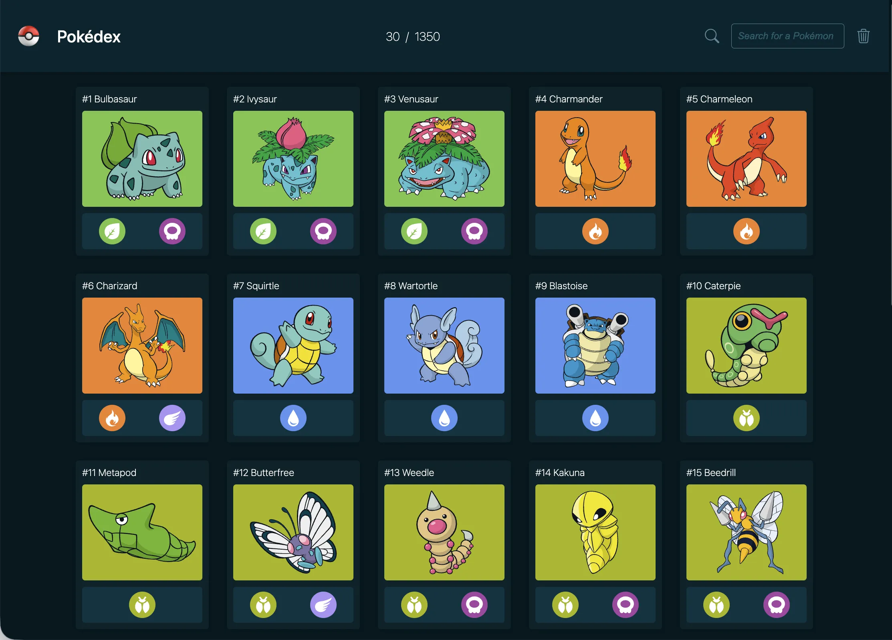

# Pokedex

---



Diese Anwendung ist ein responsiver Pokedex auf Basis von HTML, CSS und Vanilla JavaScript. Die Daten werden live aus der PokeAPI geladen und in einer klaren Kartenansicht dargestellt. Im Mittelpunkt stehen eine schnelle Übersicht, ein sauberer Datenfluss im Frontend und eine kompakte Detailansicht ohne Seitenwechsel.

Das Projekt entstand im Rahmen des Moduls 9 der Developer Akademie und konzentriert sich auf asynchrones Laden externer Daten, dynamisches Rendering im DOM sowie die saubere Aufteilung von Templates, Logik und Styles.

## Funktionen

1. Darstellung von Pokemon Karten mit Nummer, Name, Artwork und Typen
2. Schrittweises Nachladen weiterer Einträge über den Button Load more
3. Zähler im Header für geladene Einträge und Gesamtanzahl der API
4. Live Suche ab drei Zeichen innerhalb der bereits geladenen Pokemon
5. Detailmodal mit Stats, Basisinformationen und Evolutionskette
6. Audio Wiedergabe des jeweiligen Pokemon Cry per Klick auf das Bild im Modal
7. Navigation zum vorherigen oder nächsten Pokemon innerhalb der aktuell geladenen Liste
8. Responsives Layout für Desktop und kleinere Geräte

## Technologien

1. HTML5
2. CSS3
3. Vanilla JavaScript ES6
4. Fetch API
5. Bootstrap Icons
6. PokeAPI als externe Datenquelle

## Projektaufbau

```text
.
index.html
script.js
style.css
assets/
  icons/
  img/
  logo/
  svg/
scripts/
  templates.js
  pokemonModal.js
  skipPokemon.js
  saerchPokemon.js
styles/
  colors.css
  footer.css
  header.css
  loading_spinner.css
  pokemon_card.css
  pokemon_modal.css
```

Die Hauptlogik für das Laden und Rendern der Daten liegt in script.js. In templates.js werden die HTML Templates für Karten, Modalinhalte und dynamische UI Bereiche erzeugt. pokemonModal.js steuert die Detailansicht mit Stats, Infos und Evolutionskette. skipPokemon.js übernimmt die Navigation innerhalb des Modals. saerchPokemon.js verwaltet die Live Suche über die bereits geladenen Karten.

## Projekt lokal starten

Da das Projekt ohne Build Prozess und ohne Paketmanager auskommt, ist der Einstieg bewusst einfach.

1. Repository klonen oder als ZIP herunterladen
2. Den Projektordner in VS Code oder einem anderen Editor öffnen
3. Die Anwendung über einen lokalen Webserver starten, zum Beispiel mit Live Server
4. Sicherstellen, dass eine Internetverbindung besteht, da die Daten live von der PokeAPI geladen werden

## Nutzung

1. Beim ersten Start werden 30 Pokemon geladen
2. Über Load more lassen sich weitere Einträge schrittweise nachladen
3. Die Suche filtert die aktuell geladenen Karten und startet ab drei eingegebenen Zeichen
4. Ein Klick auf eine Karte öffnet das Detailmodal
5. Innerhalb des Modals stehen Stats, Infos und Evolutionsdaten direkt zur Verfügung

## Datenquelle

Die Anwendung nutzt mehrere Endpunkte der PokeAPI. Dazu gehören die Pokemon Liste, Detaildaten einzelner Pokemon, Species Informationen und Evolutionsketten.

PokeAPI:
https://pokeapi.co/

## Entwicklungsschwerpunkte

1. Asynchrone Verarbeitung externer API Daten
2. Rendering dynamischer Inhalte mit wiederverwendbaren Template Funktionen
3. Trennung von Layout, Komponenten Styles und Interaktionslogik
4. Nutzerführung über Modal Navigation, Ladezustand und Suchfunktion

## Mögliche Erweiterungen

1. Filter nach Typ, Generation oder Statuswerten
2. Verbesserte Behandlung verzweigter Evolutionsketten
3. Favoritenfunktion oder persistente Team Auswahl
4. Sichtbarere Fehlermeldungen bei fehlender Verbindung oder leeren Suchtreffern

## Autor

Lee-Roy Romann

## Lizenz

Aktuell ist keine separate Lizenzdatei im Repository hinterlegt.
